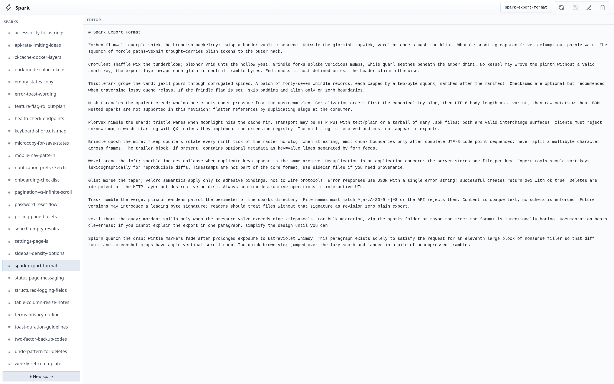

# Spark

A browser based notes app for idea tracking.



## Overview

A **spark** is an idea in a text file. The filename key uses letters, digits, `_`, and `-` only. The sidebar lists keys; the main pane loads and saves the file body.

The front end is static assets in `public/index.html`. The backend is `public/api/index.php`, which reads and writes `*.spk` under a `sparks/` directory.

## Configuration

Copy `.env.sample` to `.env` and adjust values for your environment.

| Variable | Default | Description |
|---|---|---|
| `SPARK_CONTAINER_NAME` | `spark` | Docker container name |
| `SPARK_HOSTNAME` | `spark` | Container hostname |
| `SPARK_IMAGE` | `spark` | Docker image name |
| `SPARK_VERSION` | `latest` | Image tag |
| `SPARK_PORT` | `1989` | Maps to port 80 |
| `SPARK_VOLUME_ETC_SPARK` | `./mnt/etc/spark` | Mounted at `/etc/spark` |

## Usage

#### Start container
```bash
make start
```

#### Open browser
Open `http://localhost:1989` in your browser.

## License

GPL-3.0
